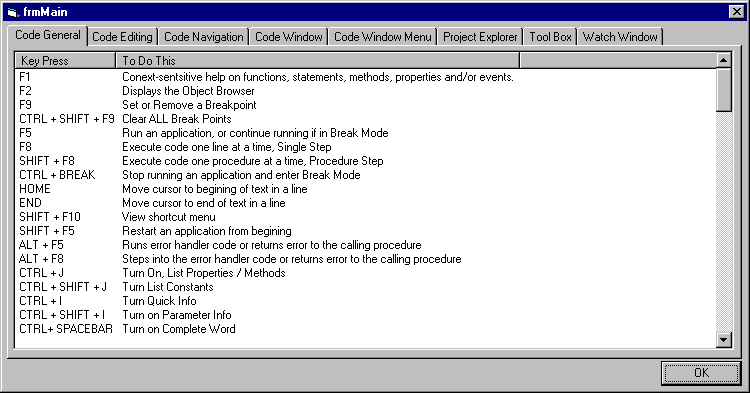



## Visual Basic AddIn \- Visual Basic 6 Shortcut Keys

### Description

A Visual Basic 6 Addin that displays the all shortcut keys, on tabbed dialog box.

Very usefull for speeding up your devlopement.
 
### More Info
 

             |
---                |---
**Submitted On**   |2001-03-09 15:29:14
**By**             |[Richard Burrows](https://github.com/Planet-Source-Code/PSCIndex/blob/master/ByAuthor/richard-burrows.md)
**Level**          |Advanced
**User Rating**    |5.0 (10 globes from 2 users)
**Compatibility**  |VB 3\.0, VB 4\.0 \(16\-bit\), VB 4\.0 \(32\-bit\), VB 5\.0, VB 6\.0
**Category**       |[Complete Applications](https://github.com/Planet-Source-Code/PSCIndex/blob/master/ByCategory/complete-applications__1-27.md)
**World**          |[Visual Basic](https://github.com/Planet-Source-Code/PSCIndex/blob/master/ByWorld/visual-basic.md)
**Archive File**   |[CODE\_UPLOAD171163162001\.zip](https://github.com/Planet-Source-Code/richard-burrows-visual-basic-addin-visual-basic-6-shortcut-keys__1-21670/archive/master.zip)

